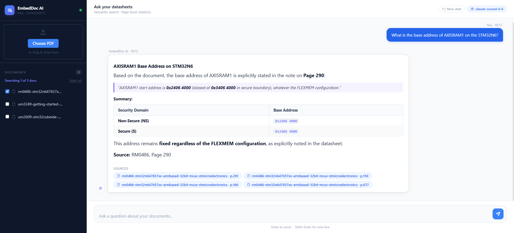

# EmbedDoc AI


**A self-hosted RAG application for querying large technical PDF documents with natural language.**

Engineers working with embedded systems documentation spend hours searching through 4,000-page reference manuals for a single register value or peripheral configuration.

EmbedDoc AI lets you upload any PDF (datasheets, reference manuals, user guides) and ask precise questions in plain English. Answers are grounded strictly in your documents and come with clickable page-level citations, so you can verify every claim in seconds.

---



---

## Features

- **Natural language Q&A** over any uploaded PDF
- **Page-level citations**: every answer links directly to the source page in the original document
- **Multi-document support** with per-query document filtering (ask only the ref manual, skip the datasheet)
- **Conversation history**: follow-up questions understand context from previous answers (4-turn window)
- **Background ingestion** with live progress tracking; upload a 4,000-page manual and keep working
- **Table-aware parsing** via pdfplumber; register maps and pin tables survive extraction as proper markdown
- **MMR retrieval**: prevents a single large document from monopolising all result slots
- **Cross-encoder reranking**: second-pass precision scoring ensures the most relevant chunk reaches Claude first
- **GPU auto-detection**: embeddings run on CUDA / MPS when available, CPU otherwise

---

## Tech Stack

| Tool | Role | Why this choice |
|---|---|---|
| **FastAPI** | REST API + static file serving | Automatic OpenAPI docs, Pydantic validation, async-ready; mounts the frontend as static files so no separate web server is needed |
| **PostgreSQL + pgvector** | Vector store | Persistent, ACID-compliant, and already familiar to most teams. Avoids the drift of in-memory stores (FAISS, Chroma) that lose data on restart |
| **LangChain + langchain-postgres** | RAG orchestration | Abstracts MMR search, metadata filtering, and vector table management; keeps retrieval code concise |
| **BAAI/bge-small-en-v1.5** | Bi-encoder embeddings | Strong English technical text performance, runs entirely on CPU (~130 MB), normalized output simplifies cosine distance math |
| **cross-encoder/ms-marco-MiniLM-L-6-v2** | Reranker | Scores query and chunk together for higher precision than bi-encoder similarity; fast on CPU for small k |
| **Anthropic Claude Sonnet 4.6** | Answer generation | Instruction-following, low hallucination rate, long context window for multi-chunk prompts |
| **pdfplumber** | PDF parsing | Extracts tables as structured rows (vs PyMuPDF which returns garbled whitespace-separated text); critical for register maps and pin tables |
| **HuggingFace sentence-transformers** | Embedding + reranking runtime | Unified library for both bi-encoder and cross-encoder models; GPU/CPU device selection in one flag |

---

## Setup

### Prerequisites

- Python 3.11+
- PostgreSQL 14+ with the [pgvector extension](https://github.com/pgvector/pgvector)
- An [Anthropic API key](https://console.anthropic.com/)

### 1. Clone and create a virtual environment

```bash
git clone https://github.com/YOUR_USERNAME/embeddoc-ai.git
cd embeddoc-ai

python -m venv venv
# Windows
venv\Scripts\activate
# macOS / Linux
source venv/bin/activate
```

### 2. Install dependencies

```bash
pip install -r requirements.txt
```

> The first run also downloads the embedding model (~130 MB) and the reranker model (~85 MB) from HuggingFace. These are cached locally after the first download.

### 3. Set up PostgreSQL

```sql
-- Run as a superuser (e.g. postgres)
CREATE DATABASE embeddoc;
CREATE USER embeddoc WITH PASSWORD 'embeddoc';
GRANT ALL PRIVILEGES ON DATABASE embeddoc TO embeddoc;

-- Connect to the embeddoc database, then:
CREATE EXTENSION IF NOT EXISTS vector;
```

### 4. Configure environment variables

Create a `.env` file at the project root:

```env
ANTHROPIC_API_KEY=sk-ant-...

# PostgreSQL - defaults match the values above
POSTGRES_USER=embeddoc
POSTGRES_PASSWORD=embeddoc
POSTGRES_DB=embeddoc
POSTGRES_HOST=localhost
POSTGRES_PORT=5432

# Optional overrides
# EMBEDDING_MODEL=BAAI/bge-small-en-v1.5
# CLAUDE_MODEL=claude-sonnet-4-6
# EMBEDDING_DEVICE=cpu   # force cpu / cuda / mps
```

### 5. Run the server

```bash
uvicorn app.main:app --reload
```

The database tables are created automatically on first startup. Open [http://localhost:8000](http://localhost:8000) in your browser.

---

## Usage

### Uploading a document

1. Drag and drop a PDF onto the sidebar, or click **Choose PDF**
2. Optionally enter a short display name (e.g. `STM32N6 Ref Manual`)
3. Click **Ingest document**: the card shows live progress as chunks are embedded
4. Once done, the document appears in the sidebar with a checkbox and open/delete buttons

### Asking questions

Type any natural language question and press **Enter**. Answers cite their sources; click any citation pill to open the PDF at the exact page.

### Document filtering

Use the checkboxes in the sidebar to restrict a question to specific documents. Useful when you have both a reference manual and a datasheet loaded and want to target only one.

### Conversation history

The system keeps the last 4 exchanges in context, so follow-up questions work naturally. Click **New chat** to clear the history and start a fresh conversation.

---

## Design Decisions

### Hallucination guardrail

Every question goes through three layers before Claude sees any context:

1. **Cosine distance threshold (0.70).** Chunks with a distance above this value are dropped outright. If nothing passes, the system returns a fixed *"I couldn't find reliable information"* message rather than calling Claude at all.
2. **System prompt constraint.** Claude is instructed to answer *strictly from the provided context* and to say so clearly if the context is insufficient.
3. **Source citations.** Every answer includes the exact document name and page number. Hallucinated content cannot be cited, so errors are immediately verifiable by the user.

### Retrieval: MMR over top-k similarity

Plain top-k similarity search lets one large document dominate all result slots. A 4,800-page reference manual will crowd out a 33-page guide on almost every query. **Maximal Marginal Relevance (MMR)** solves this by selecting chunks that are both relevant and diverse: it fetches 20 candidates by similarity, then greedily picks 4 that maximise coverage while minimising redundancy.

### Two-stage retrieval: MMR + cross-encoder

The embedding model (bge-small) is a **bi-encoder**: it embeds query and document independently, making similarity search fast but approximate. After MMR narrows the field to 4 candidates, a **cross-encoder** (ms-marco-MiniLM-L-6-v2) re-reads the query and each chunk *jointly*, producing a much more precise relevance score. The top-ranked chunk is placed first in Claude's context, where it receives the most attention.

### Chunking strategy

`RecursiveCharacterTextSplitter` at 1,000 characters with 200-character overlap. This is the standard production choice: fast, predictable, and the overlap preserves cross-boundary context. A higher-quality alternative is `SemanticChunker` (langchain-experimental), which embeds every sentence to detect topic boundaries, but ingest time scales poorly on CPU (20-40 min for a 1,000-page document vs. ~5 min with fixed-size splitting), making it impractical for a local tool.

### Conversation history window

Only the last 4 exchanges (8 messages) are sent to Claude. Including earlier turns would send stale retrieved context and grow token cost linearly. The window is cleared on **New chat** or page refresh, keeping session state entirely client-side.

---

## Project Structure

```
embeddoc-ai/
├── app/
│   ├── main.py              # FastAPI app, routes, background ingestion
│   ├── config.py            # Settings (env vars, device auto-detection)
│   ├── database.py          # pgvector setup, document metadata CRUD
│   ├── services/
│   │   ├── llm.py           # Claude answer generation with history
│   │   ├── retriever.py     # MMR search + cross-encoder reranking
│   │   └── ingestion.py     # Batch embedding with progress callbacks
│   └── utils/
│       └── pdf_parser.py    # pdfplumber parsing, table → markdown, chunking
├── frontend/
│   └── index.html           # Single-file SPA (no build step)
├── documents/               # Uploaded PDFs (git-ignored)
├── requirements.txt
└── .env                     # Secrets (git-ignored)
```

---

## License

MIT — see [LICENSE](LICENSE) for details.
